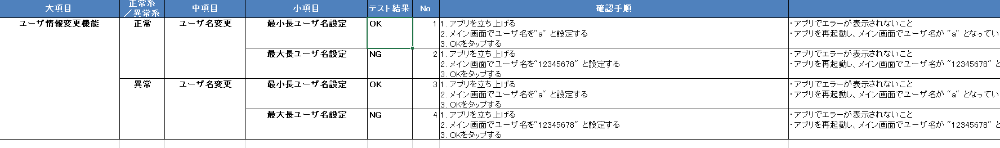

# md_test_case_to_excel
Markdownで書かれたテスト仕様書をExcel形式に変換します。Markdown+GitHubでテスト仕様書を差分管理したいヒトはご活用ください。




## Get Started

```bash
$ python converter.py -h
$ python converter.py -f sample.md -m
```

## Options

実行時に指定できるオプションとして以下があります。

|オプション名|説明|
|:---|:---|
|-h, --help| 引数のヘルプ表示|
|-f, --file| 入力ファイルパス|
|-m, --merge| エクセルセルをマージするか|

## Environments

- Python 3.6 or higher
- pandas
- openpyxl 3.0.0 or higher
- PyYAML 5.0.0 or higher
- docopt

以下のコマンドで推奨環境を一括インストールできます。

```bash
$ pip install pandas openpyxl==3.0.5 pyyaml==5.3.1 docopt
```

## Directory Structure

主なファイルは以下の通り。

```
.
|-- config.yaml    # ユーザ設定ファイル 
|-- converter.py   # MAIN
|-- markdown.py    # markdown関係の処理
|-- excel.py       # excel関係の処理
|-- sample.md      # markdown型テスト仕様書のサンプル 
```

## Release Notes

### v0.1.0 (2020/12/08)

- First Commit!