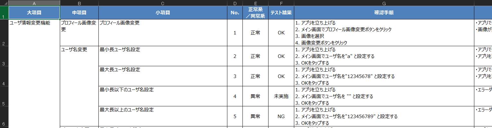

# md_test_case_to_excel

Markdownで書かれたテスト仕様書をExcel形式に変換します。Markdown+GitHubでテスト仕様書を差分管理したいヒトはご活用ください。



## Environment

本レポジトリは以下の環境でテストしています。

- Windows 11
- Python 3.11
- pandas 2.2.2
- openpyxl 3.1.5
- pydantic 2.9.1
- pyyaml 6.0.2

## Get Started

### Install dependencies

```shell
pip install -r requirements.txt
```

### Write a test specification by Markdown

サンプルファイルは`example/sample.md`にあります。

```markdown
# テスト仕様書

## 大項目
### 中項目
#### [正常|異常|準正常] [OK|NG|未実施|--] テストケース名
1. 確認手順
2. 確認手順
* [ ] 想定動作
* [ ] 想定動作
- 備考
```

### Convert markdown to xlsx

マークダウンファイルをエクセルファイルに変換します。

```bash
$ python3 converter.py -h
$ python3 converter.py -f example/sample.md -m
```

実行時に指定できるオプションとして以下があります。

|オプション名|説明|
|:---|:---|
|-h, --help| 引数のヘルプ表示|
|-f, --file| 入力ファイルパス|
|-m, --merge| エクセルセルをマージするか|

セル幅や列名など、その他の設定は`config.yaml`を変更してください。


## Release Notes

### v0.2.0 (2024/9/16)

- ソースコード全体をリファクタリング
- 設定ファイルの構造を見直し
- 最新バージョンのpandas, openpyxl, pydantic, pyyamlに対応
- テストケースの未実施ステータス名を変更（"--" -> "未実施"）
- 準正常系を追加（"正常系", "異常系" -> "正常", "異常", "準正常"）

### v0.1.0 (2020/12/08)

- First Commit!

## Acknowledgements

The format of markdown borrows heavily from [ryuta46/eval-spec-maker](https://github.com/ryuta46/eval-spec-maker). The python code borrows from [torisawa/convert.py](https://gist.github.com/toriwasa/37c690862ddf67d43cfd3e1af4e40649)

## Limitations

Headers in xlsx are in Japanese only.
